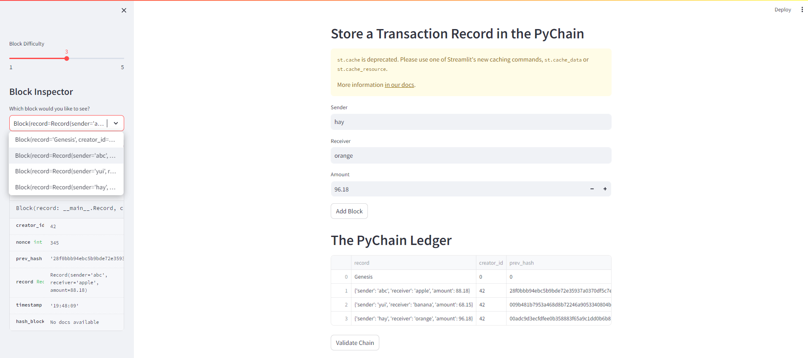
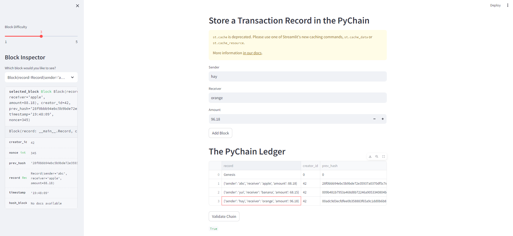

# PyChain Ledger

A blockchain-based ledger system is built and completed with a user-friendly web interface. This ledger should allow partner banks to conduct financial transactions (that is, to transfer money between senders and receivers) and to verify the integrity of the data in the ledger.

1. In the terminal, run the Streamlit application by using `streamlit run pychain.py`.

3. Enter values for the sender, receiver, and amount, and then click the Add Block button. Do this several times to store several blocks in the ledger.

4. Verify the block contents and hashes in the Streamlit dropdown menu. Take a screenshot of the Streamlit application page, which details a blockchain that consists of multiple blocks.

The screenshot is as below Fig.1 

5. Test the blockchain validation process by using the web interface. Take a screenshot of the Streamlit application page, which indicate the validity of the blockchain. 

The screenshot is as below Fig.2

Clearly, this ledger allows partner banks to conduct financial transactions (that is, to transfer money between senders and receivers) and to verify the integrity of the data in the ledger.

